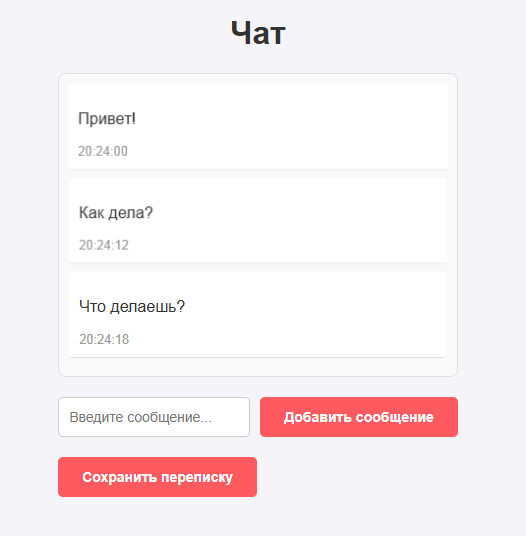

# ToDoList(3 pages)ReactRedux

## Cтек: TypeScript, Vue
- Реализовано отображение сообщений чата, отображение списка сообщений, кнопка для добавления сообщений(имитация)
- Добавлена функциональность сохранения переписки в текстовый файл через кнопку сохранить переписку

### Инструкция по запуску
- Создайте папку для проекта и перейдите в неё.
- Склонируйте репозиторий `git clone git@github.com:AplusO1/ReactReduxTS-3-Pages.git`
- Установите зависимости `npm install`
- Запускайте проект `npm run serve`
- Запустить линтер `npm run lint`
---
